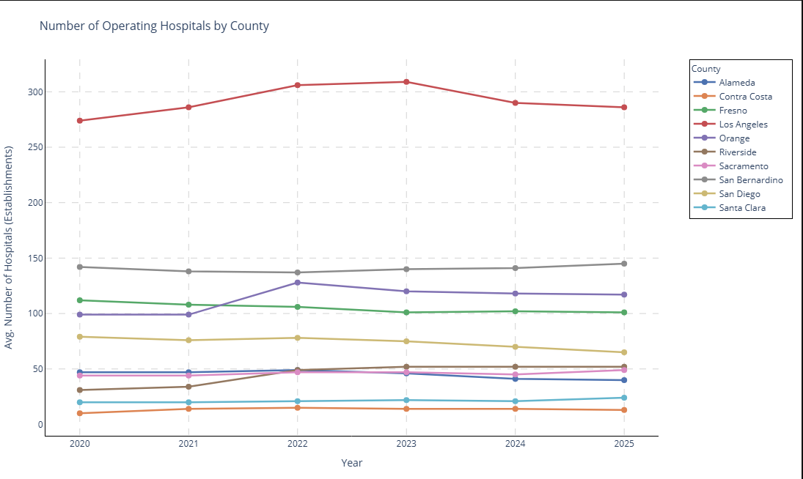

## Project Overview

  This project analyzes county-level hospital labor trends to address a real business problem in the U.S. healthcare sector.
  
---

## Business Problem

  Californian counties are facing rising hospital labor costs, healthcare workforce shortages, and changing labor market conditions.
  
---

## Business Question

  Based on county-level labor trends, which geographic markets show signs of a breaking point in the hospital sector (rising costs alongside a shrinking workforce) that may indicate future facility closures   or service reductions?
  
---

## Data

  The analysis uses six years (2020–2025) of hospital wage and employment data across ten California counties, together with the National Average Weekly Wage and the U.S. Employment Cost Index (ECI) obtained   from the Bureau of Labor Statistics (BLS) and Quarterly Census of Employment and Wages (QCEW).
  
---

## Analysis

- Number of Operating Hospitals By County
  

- Share of Employment by Ownership Type

- Overall Employment Rate

- Average Weekly Wages by Ownership Type

- Total Monthly Hospital Wages

.png)

- Year-On-Year Wage Growth

- Median Weekly Wage by Ownership Type

- National Average VS Counties (Median Weekly Wages)

- Employment Changes Since 2020

- National ECI Growth Rate VS County Wage Growth

## Dashboard

...

---

## Key Findings

- **Alameda County appears to be at the greatest operational risk**. Between 2020 and 2025, employment declined while average weekly wages increased by approximately 30%, indicating simultaneous workforce shortages and rising labor costs.
- Orange County recorded the highest wage growth (approximately 66%) and consistently exceeded the national Employment Cost Index, suggesting **substantial labor cost pressure**.
- **Los Angeles** maintained the largest hospital workforce throughout the study period and experienced only a slight decline in employment, indicating **comparatively greater resilience**.
- Fresno County recorded the **lowest wage growth** and the **least wage pressure** relative to the national benchmark.
- Private hospitals represented the largest share of hospital ownership, while Federal hospitals offered the highest median weekly wages.

---

## Tools

- Python
- Pandas
- Matplotlib
- Seaborn
- Excel
- Tableau
  
---
## Data Sources
Bureau of Labor Statistics (BLS)
Quarterly Census of Employment and Wages (QCEW)
