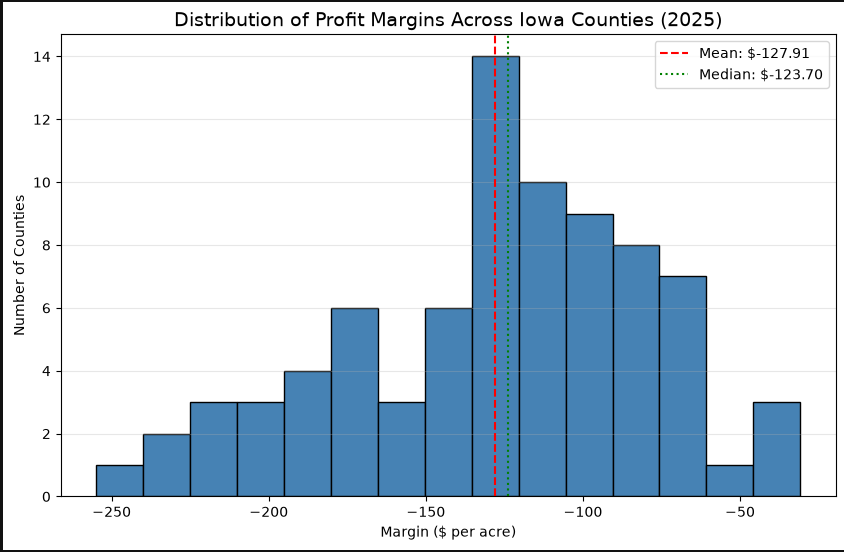
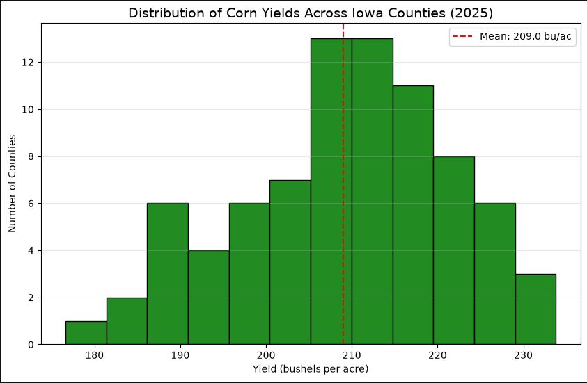
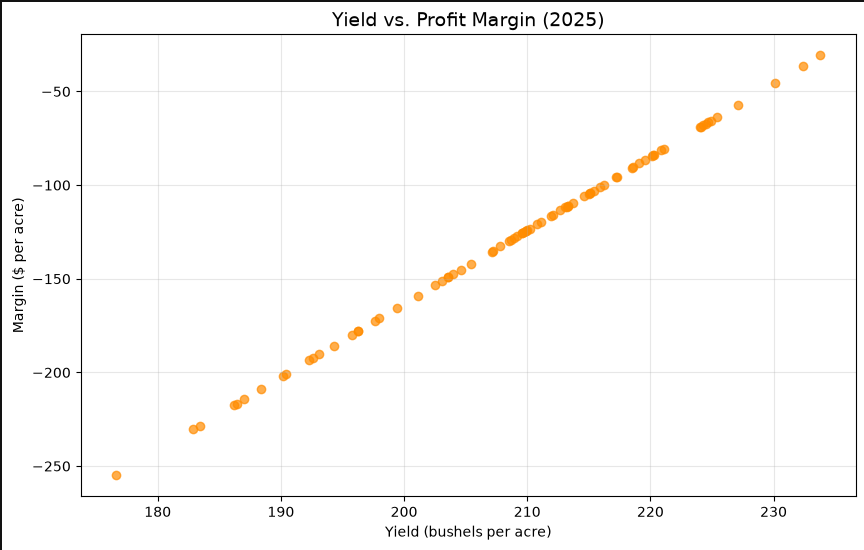
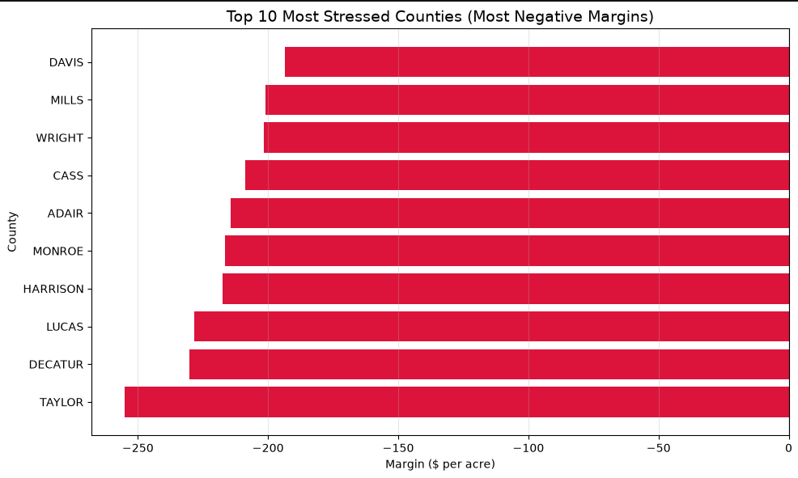
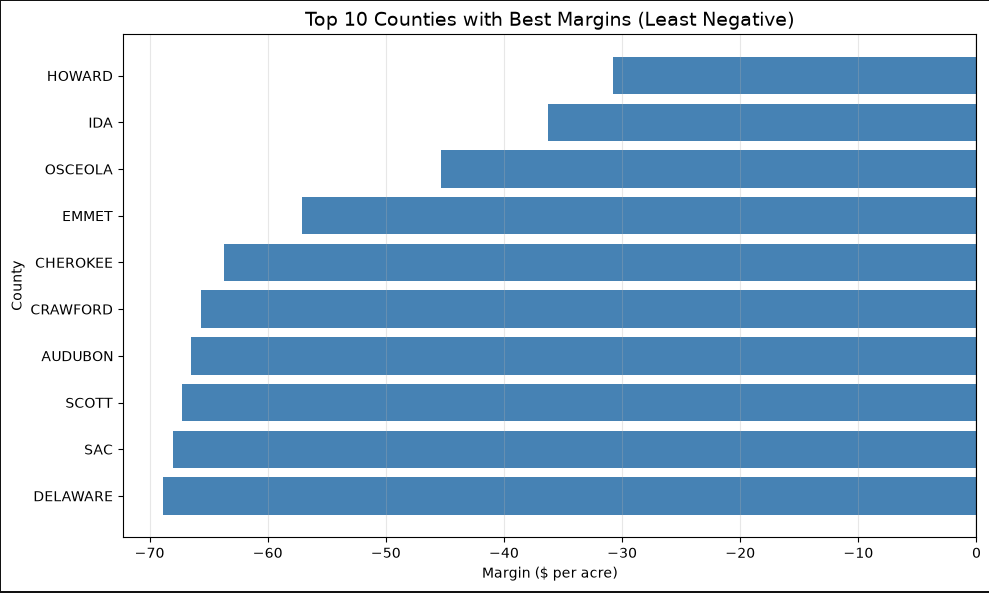
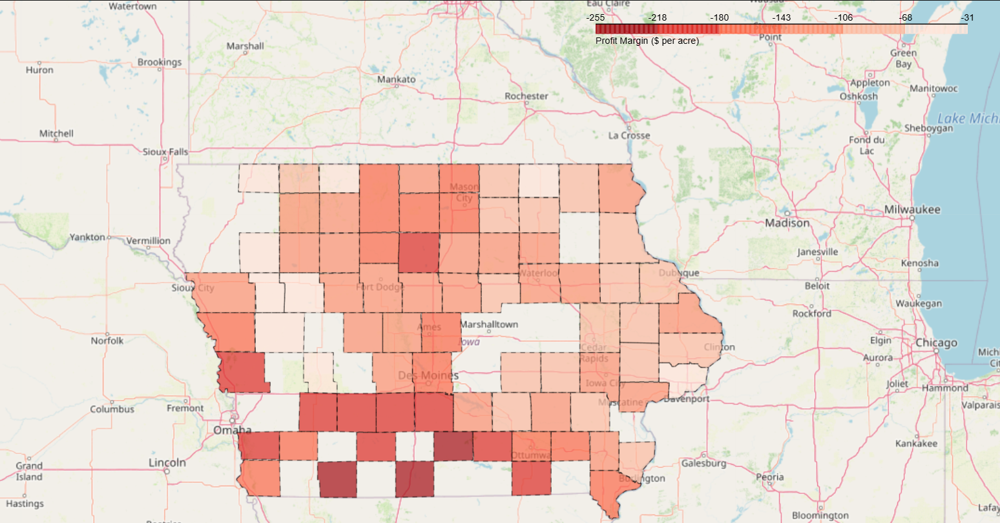
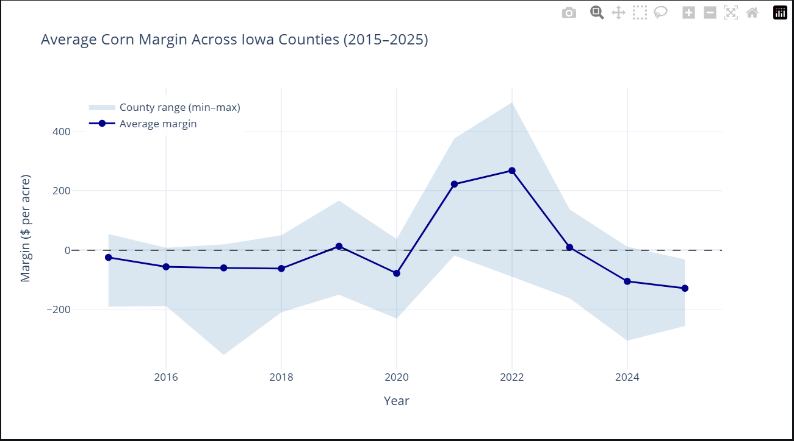
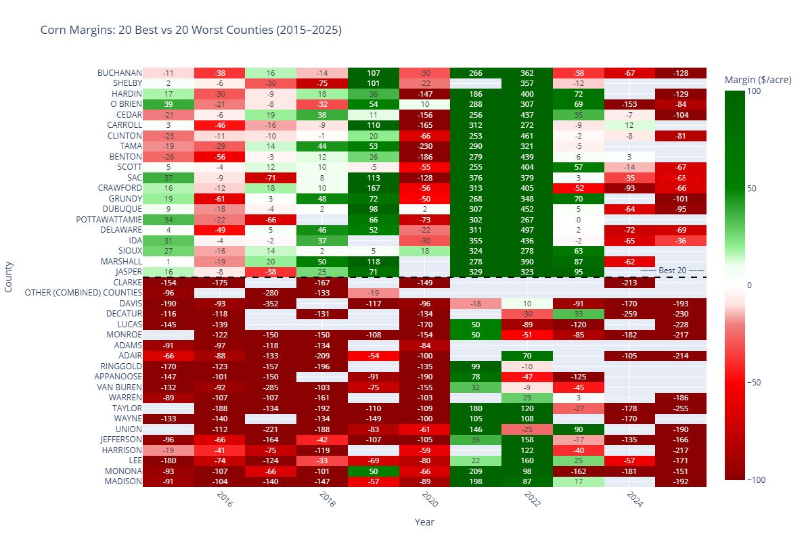

# Iowa Corn Margin Stress Analysis (2025)

## Overview
US corn farmers are facing a severe margin squeeze. Production costs remain high while commodity prices fluctuate, leaving many operations financially vulnerable. This project identifies which Iowa counties are under the most financial pressure by combining live USDA yield data with cost of production estimates. The final output is a county‑level ranking of estimated profit margins, highlighting the regions at greatest risk.

---

## Conclusion
- Statistically, Corn farming in the US is a **risky** business in 2026.
- In the past 3 years, Iowa counties experienced a **147.6% decline** in average corn profit margin, falling from **$267/acre** to **-$127/acre**.
- A **$395/acre reversal** that has put every county in the red
- Historically, 2021 and 2022 had $222-$267 average margin per acre, but 2025 shows a **severse downturn across all counties**.

---

## Data Sources
This analysis uses two distinct data sources:

1.  **USDA Quick Stats API** – Provides county‑level corn yields for Iowa from 2015 to 2025.  
    *Endpoint: `https://quickstats.nass.usda.gov/api`*  
    *Requires a free API key (obtainable from the USDA website).*

2.  **USDA ERS Commodity Costs and Returns** – Provides cost of production and harvest price estimates.  
    *Download page: `https://www.ers.usda.gov/data-products/commodity-costs-and-returns/`*  
    *File used: `CornCostReturn.xlsx` (Recent Cost and Returns table)*

---

## Limitations

1. **Cost Proxy** – ERS data only provides regional cost estimates (Heartland region). County‑specific costs are not available, so this average is applied uniformly to all Iowa counties. In reality, input costs vary by county due to differences in land values, labor, and input prices.

2. **Fixed Price** – A single annual harvest price is used for all counties. This ignores local basis differences and within‑year price volatility.

3. **Missing Data** – Not all 99 Iowa counties reported yield for 2025; the final dataset includes 82 counties.

4. **Simplified Margin Calculation** – Margin = (Yield × Price) – Cost. This does not include government subsidies, crop insurance payments, or other farm income sources.

5. Manual Data Download – The ERS cost data must be downloaded manually as a separate Excel file. There is no public API for cost data, so the process is not fully automated. The Excel file must be placed in the project directory.

---

## Methodology

1.  **Yield Data** – Pulled from the USDA Quick Stats API, filtered to corn, Iowa, county‑level granularity, and bushels per acre.
2.  **Data Cleaning** – Removed blank county entries, resolved duplicate survey records, and kept only the `ALL PRODUCTION PRACTICES` records.
3.  **Cost & Price Extraction** – Extracted the Heartland region’s **total cost per planted acre** ($947.29) and **harvest price per bushel** ($3.92) for 2025 from the ERS Excel file.
4.  **Margin Calculation** – For each county in 2025:  
    `Margin = (Yield × Price) – Cost`
5.  **Ranking** – Counties were sorted by margin ascending, with the most negative margins indicating the highest financial stress.

---

## Key Assumptions & Limitations
- **Cost Proxy** – The ERS data only provides regional cost estimates (Heartland region). This average is applied uniformly to all Iowa counties, as county‑specific costs are not publicly available.
- **Fixed Price** – The harvest price is assumed constant across the state, which is a simplification of real‑world local basis differences.
- **Missing Data** – Not all 99 Iowa counties reported yield for 2025; the final dataset includes 82 counties.
  
---

## Analysis
- Profit Marin Across Counties

- Distribution Of Corn Yields

- Correlation Between Yield And Profit Margin

- Highest Corn Margin Pressure In Iowa

- Lowest Corn Margin Pressure In Iowa

- Heatmap of Counties (Plotly)

- Trend of Average Corn Margin

- Heatmap of Best 20 and Worst 20 Counties

---

## Results
Key findings from the 2025 analysis:

- **All 82 counties** in the dataset show **negative margins** – meaning every county is projected to lose money per acre under the Heartland cost assumptions.
- **Worst Hit County** – Taylor County, with a margin of **-$255.02 per acre**.
- **Least Affected County** – Howard County, with a margin of **-$30.79 per acre**.
- **State‑wide Average** – The average loss across all counties is **approximately -$127 per acre**.
- **Yield is the sole differentiator** – Because costs and prices are fixed, the scatter plot of Yield vs Margin forms a perfect straight line.

## Tools Used
- Python 3 – Core programming language

- Pandas – Data manipulation and analysis

- Requests – API data ingestion

- Matplotlib – Visualisation and plotting

- Ms Excel – Reading Excel files
